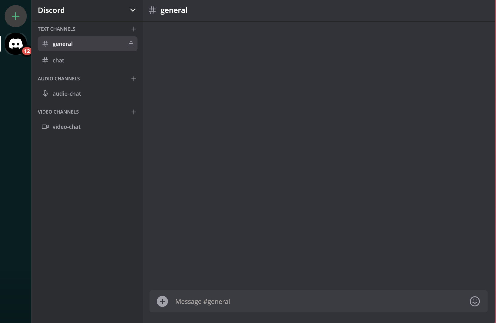

  

<h1 align="center">Baatcheet✨️</h1>

    <a href="https://baatcheet.vercel.app/" target="blank">View Demo</a>
    ·
    <a href="https://github.com/Devansh-365/baatcheet/issues/new/choose">Report Bug</a>
    ·
    <a href="https://github.com/Devansh-365/baatcheet/issues/new/choose">Request Feature</a>

### Introducing Baatcheet ✌️

Connect Better with Baatcheet: Real-time Chats, Video Calls, and Dynamic Channels, Inspired by Discord.

## 🚀 Demo

Try the App: [Baatcheet](https://baatcheet.vercel.app/)

## 🛡️ License

This project is licensed under the MIT License - see the [`LICENSE`](LICENSE) file for details.

---

<h3 align="center">
Baatcheet needs a ⭐️ from you
</h3>
